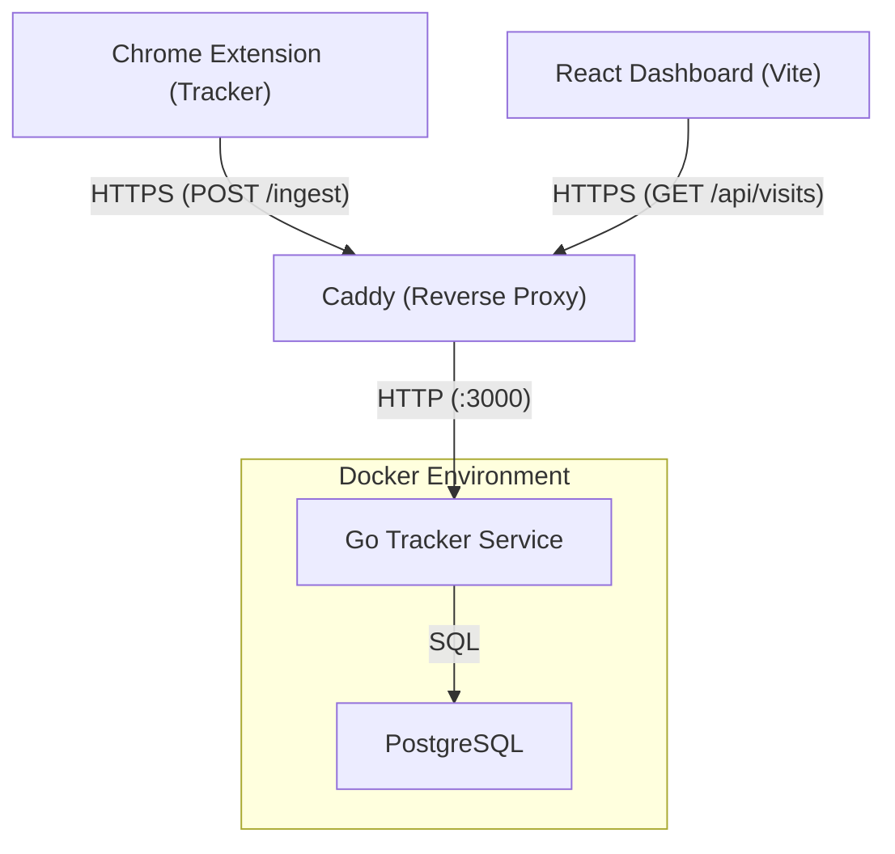

# Nexus Diet - Information Dashboard Architecture

This document records the key architectural choices and the reasoning behind them.

## 1. Data Collection Strategy

### Content Extraction via Readability.js
To accurately track the user's "information diet," we must separate the signal (actual content) from the noise (boilerplate, ads, navigation).

**Decision**: We use a **Hybrid Approach**:
1.  **`Readability.js`**: For the "Meat" (Main Body Text, Title, Excerpt).
2.  **Native DOM Scraping**: For the "Skeleton" (Headings, Metadata, OG Tags).

**Reasoning**:
-   **Readability is Aggressive**: It strips away *everything* it thinks is not the main article. Sometimes that includes useful context like:
    -   **Subtitles/Headings**: It might flatten the hierarchy.
    -   **Metadata**: It ignores `<meta>` tags (keywords, site name, type).
    -   **Images/Video**: While it keeps some, it might strip others that are relevant to "media diet."
-   **Fallback Safety**: If Readability fails (e.g., on a React Single Page App that loads content dynamically), native scraping ensures we still get *something* (title, URL, raw text).

### Privacy-First Storage (IndexedDB)
**Decision**: By default, data is stored locally in the browser's IndexedDB.

**Reasoning**:
-   **Privacy**: User browsing history is sensitive. It should not leave the device.
-   **Capacity**: IndexedDB handles large amounts of text data much better than `chrome.storage.local`.

### Hybrid Storage / Server-Sync (Optional)
**Decision**: Users can opt-in to sync their data to a private Go-based backend (`tracker`) and PostgreSQL database.

**Reasoning**:
-   **Cross-Device Access**: Allows users to view their diet history across multiple browser instances.
-   **Advanced Analysis**: Enables heavier NLP and background processing that might be too resource-intensive for the browser service worker.
-   **Self-Hosting**: Designed for technically savvy users to host their own secure data vault.

## 2. Backend Architecture (Go)

The `tracker` service is a Go-based REST API that handles data ingestion and persistence.

-   **Ingestion Endpoint**: `POST /ingest` receives raw HTML and metadata from the extension.
-   **Server-Side Parsing**: Uses `go-readability` (a port of Mozilla's algorithm) to extract clean content server-side. This ensures consistency between browser-stored and server-stored data.
-   **Concurrency**: Built using Go's standard `net/http` and `pgx/v5` for high-performance, concurrent database access.

## 3. Site Classification & Nutritional Scoring

To understand the "nutritional value" of the user's information diet, the app assigns a broad topic category (e.g., Technology, Sports, Politics) and a "Nutrition Score" (1-10) to each visited page.

**Decision**: Keyword-based Heuristics & Engagement Tracking.
-   **Categorization**: Pages are scored in the Go `classifier` package during ingestion. We weight keywords based on where they appear (Title vs Description vs Body).
-   **Nutritional Scoring**: *Deferred for Future Work*. We plan to calculate "Nutrition Score" (1-10) factoring in the assigned category (e.g. Science gets a bonus, Entertainment a penalty), the word count, *and* reading engagement metrics (`activeReadTimeMs` and `maxScrollPercent`).
-   *Future AI Integration*: This function is designed to be easily swapped out with a local LLM or `Transformers.js` model running in-browser, without changing how the background script or database fundamentally operates.

## 4. Tech Stack

### Extension
-   **Manifest V3**: Future-proof Chrome extension standard.
-   **Webpack**: Used to bundle modules (like `@mozilla/readability` and `classifier.js`).
-   **Vanilla JS**: Minimalist UI for the background workers, content scripts, and popup. The extension focuses solely on ingestion.

### Dashboard (Frontend)
-   **React + Vite**: A standalone modern web application for visualizing the user information diet.
-   **Decoupled Architecture**: Separated from the browser extension so it can act as an independent UI client across multiple platforms (Web, Mobile browsers, etc.), querying the Go Backend as the single source of truth.

### Backend & Infrastructure
-   **Go**: High-performance backend service.
-   **PostgreSQL**: Relational database for persistent storage.
-   **Docker & Docker Compose**: Containerized deployment for easy setup.
-   **Caddy**: Secure reverse proxy and TLS provider (internal and external IPs).

## 5. Deployment Architecture

## 6. Data Schema

The system uses a unified data model, whether stored in IndexedDB (extension) or PostgreSQL (backend).

### PostgreSQL Schema (`visits` table)

| Field | Type | Description |
| :--- | :--- | :--- |
| **`id`** | `SERIAL` | Primary Key. |
| **`url`** | `TEXT` | The full URL of the visited page. |
| **`title`** | `TEXT` | The clean article headline. |
| **`description`** | `TEXT` | Meta description or excerpt. |
| **`snippet`** | `TEXT` | Short excerpt for UI display. |
| **`content`** | `TEXT` | Full readable body text. |
| **`word_count`** | `INTEGER` | Computed length of the article. |
| **`site_name`** | `TEXT` | Source site name (e.g., "The Verge"). |
| **`favicon`** | `TEXT` | URL to the site's favicon. |
| **`created_at`** | `TIMESTAMP` | Record creation time. |

### IndexedDB Schema (visits)

| Field | Type | Source | Description |
| :--- | :--- | :--- | :--- |
| **`url`** | `string` | `window.location` | The full URL of the visited page. |
| **`title`** | `string` | Readability / `document.title` | The clean article headline (preferred) or the raw page title. |
| **`contentSnippet`** | `string` | Readability / `substring` | A short excerpt (first few lines) for display in the UI history list. |
| **`wordCount`** | `number` | Calculated | Number of words in `contentClean`. Measuring the "nutritional value" of the visit. |
| **`favicon`** | `string` | DOM Scraping | URL to the site's favicon for UI context. |
| **`timestamp`** | `string` | `new Date()` | ISO string of when the data was collected. |
| **`h1s`, `h2s`, `h3s`** | `array` | DOM Scraping | Lists of headings. Provides the "Skeleton" structure of the page. |
| **`ogTitle`, `ogType`** | `string` | Meta Tags | Open Graph metadata (e.g. `type="article"` vs `type="video"`). |
| **`description`** | `string` | Meta Tags | The page's meta description. |

