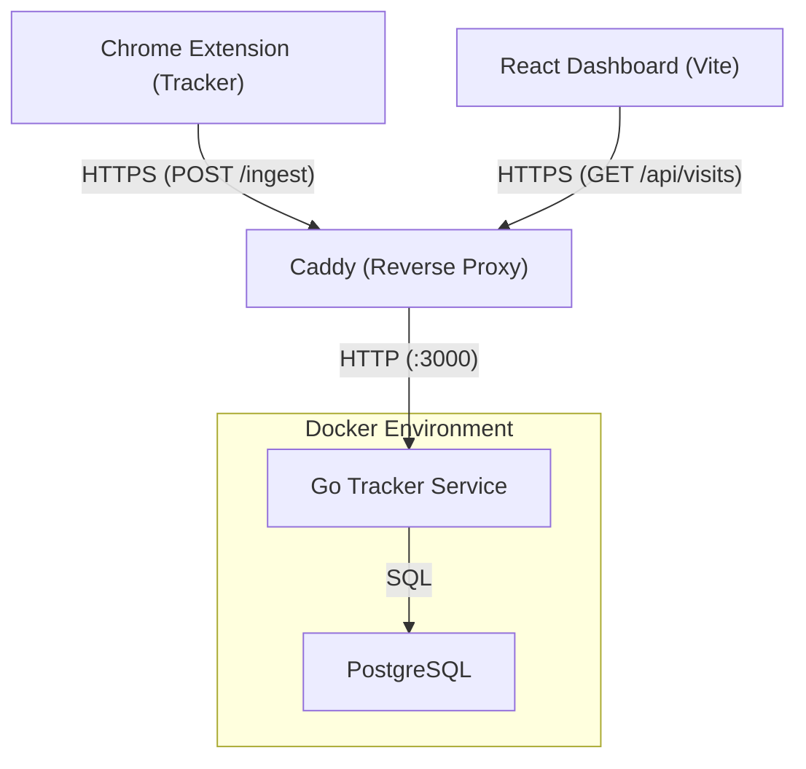

# Nexus Diet - Information Dashboard Architecture

This document records the key architectural choices and the reasoning behind them.

## 1. Data Collection Strategy

### Server-Side Content Extraction
To accurately track the user's "information diet," we must separate the signal (actual content) from the noise (boilerplate, ads, navigation).

**Decision**: We use a **Server-Side Parsing Strategy**:
1.  **Raw Ingestion**: The extension captures the `outerHTML` of the page and sends it to the Go backend.
2.  **Go-Readability**: The backend uses a Go port of Mozilla's Readability algorithm to extract the "Meat" (Body, Title, Excerpt) in a stable, isolated environment.

**Reasoning**:
-   **Performance**: Removing heavy parsing libraries from the extension makes browser tabs faster and prevents the extension from slowing down the user's focus.
-   **Consistency**: Parsing on the server ensures that every visit is processed using the exact same logic, regardless of browser version or platform.
-   **Security**: By moving complex HTML parsing to a sandbox on the server, we reduce the attack surface of the browser extension.

### Centralized Data Storage (PostgreSQL)
**Decision**: Data is pushed from the extension and stored in a centralized PostgreSQL database via the Go backend.

**Reasoning**:
-   **Cross-Device Access**: Allows users to view their diet history across multiple browser instances or mobile platforms.
-   **Advanced Analysis**: Enables heavier processing (like the categorization engine) and future deep-learning analysis that would be too resource-intensive for the browser background worker.
-   **Privacy Choice**: While the default is local network storage (self-hosted), it simplifies the extension by making it a stateless tracker rather than a local database manager.
-   **Stateless Extension**: Removing IndexedDB from the extension significantly improves performance and reduces complex sync logic.

## 2. Backend Architecture (Go)

The `tracker` service is a Go-based REST API that handles data ingestion and persistence.

-   **Ingestion Endpoint**: `POST /ingest` receives raw HTML and metadata from the extension.
-   **Server-Side Parsing**: Uses `go-readability` (a port of Mozilla's algorithm) to extract clean content server-side. This ensures consistency between browser-stored and server-stored data.
-   **Concurrency**: Built using Go's standard `net/http` and `pgx/v5` for high-performance, concurrent database access.

## 3. Site Classification & Nutritional Scoring

To understand the "nutritional value" of the user's information diet, the app assigns a broad topic category (e.g., Technology, Sports, Politics) and a "Nutrition Score" (1-10) to each visited page.

**Decision**: Keyword-based Heuristics & Engagement Tracking.
-   **Categorization**: Pages are scored in the Go `classifier` package during ingestion. We weight keywords based on where they appear (Title vs Description vs Body).
-   **Nutritional Scoring**: *Deferred for Future Work*. We plan to calculate "Nutrition Score" (1-10) factoring in the assigned category (e.g. Science gets a bonus, Entertainment a penalty), the word count, *and* reading engagement metrics (`activeReadTimeMs` and `maxScrollPercent`).
-   *Future AI Integration*: This function is designed to be easily swapped out with a local LLM or `Transformers.js` model running in-browser, without changing how the background script or database fundamentally operates.

## 4. Tech Stack

### Extension (The Tracker)
-   **Manifest V3**: Future-proof Chrome extension standard.
-   **Stateless Architecture**: The extension has ZERO local storage and ZERO third-party parsing dependencies. It is a strictly "dumb" pipe that forwards data to the backend.
-   **Vanilla JS**: Minimalist scripts (~600 bytes) ensure virtually zero overhead on the user's browser.

### Dashboard (The UI)
-   **React + Vite**: A modern standalone web application for visualizing the user information diet.
-   **Decoupled Architecture**: Hosted independently from the extension, querying the Go Backend as the single source of truth.

### Backend & Infrastructure
-   **Go**: High-performance backend service handling ingestion, classification, and API requests.
-   **PostgreSQL**: Relational database for persistent storage.
-   **Docker & Docker Compose**: Containerized deployment for easy setup.
-   **Caddy**: Secure reverse proxy and TLS provider (internal and external IPs).

## 5. Deployment Architecture

## 6. Data Schema
The system uses a centralized PostgreSQL schema. The browser extension no longer maintains a local schema or database.

### PostgreSQL Schema (`visits` table)

| Field | Type | Description |
| :--- | :--- | :--- |
| **`id`** | `SERIAL` | Primary Key. |
| **`url`** | `TEXT` | The full URL of the visited page. |
| **`title`** | `TEXT` | The clean article headline. |
| **`description`** | `TEXT` | Meta description or excerpt. |
| **`snippet`** | `TEXT` | Short excerpt for UI display. |
| **`content`** | `TEXT` | Full readable body text. |
| **`word_count`** | `INTEGER` | Computed length of the article. |
| **`site_name`** | `TEXT` | Source site name (e.g., "The Verge"). |
| **`favicon`** | `TEXT` | URL to the site's favicon. |
| **`category`** | `TEXT` | The identified topic (Tech, Science, etc.). |
| **`captured_at`** | `TIMESTAMPTZ` | Record creation time in UTC. |

